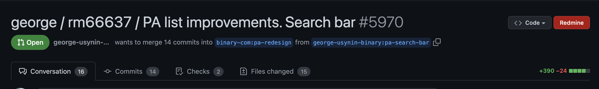
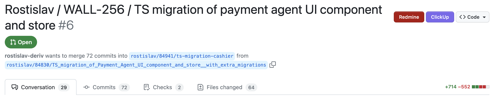

# GitHub Redmine Button

Chrome extension that Adds a Redmine button to GitHub pull requests pages if the issue number is mentioned in the PR title.

## Manual Install

* Clone this repo
* Open `chrome://extensions/`
* Enable `Developer mode`
* Select `Load unpacked`
* Select the `extension` folder
